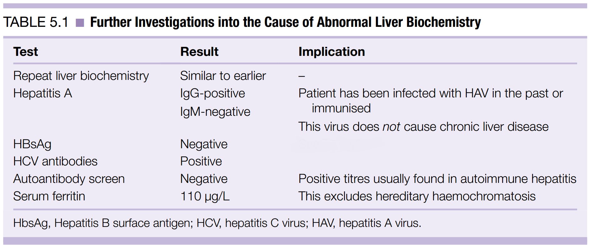
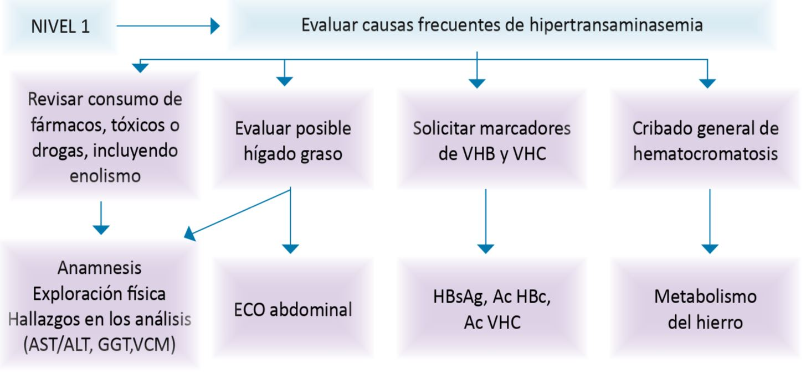
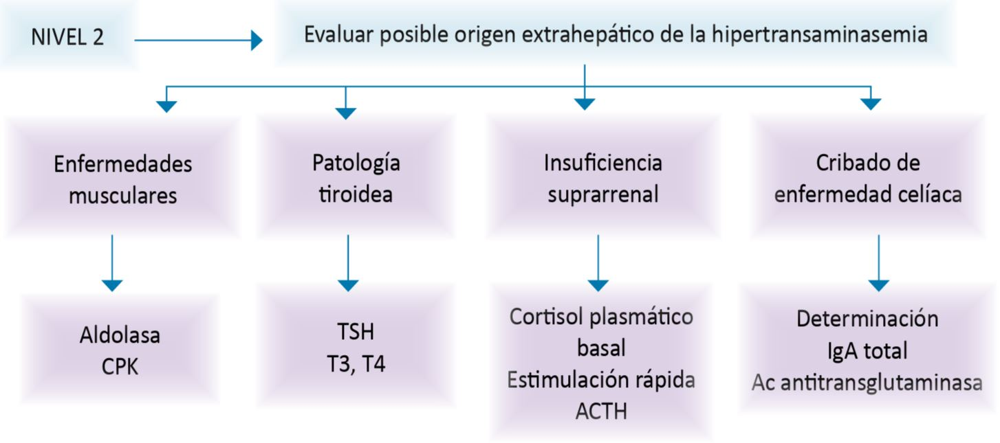
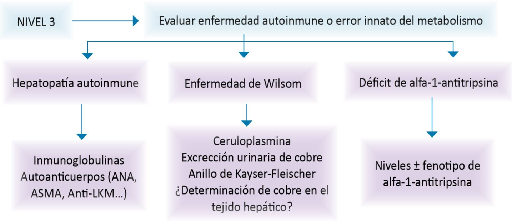
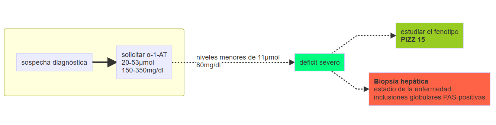
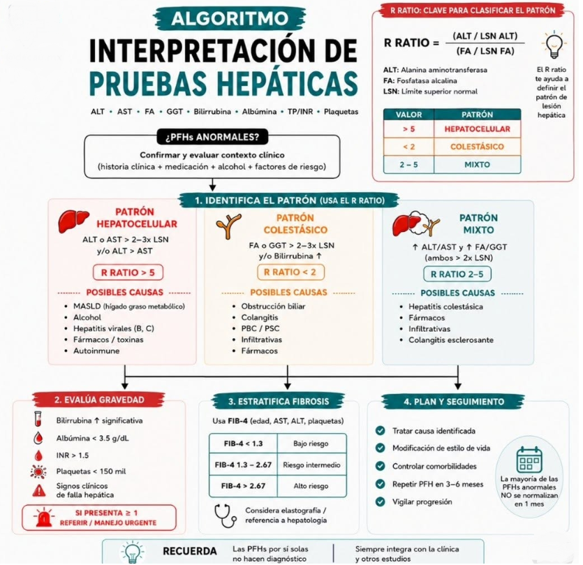

background-image: url("img/ojo.jpg")
background-size: cover

```{r style-panelset, echo=FALSE} 
library(xaringanExtra)
style_panelset_tabs(foreground= "honeydew", background = "seagreen")
```


```{r xaringanthemer, include=FALSE}
library(xaringanthemer)
style_mono_accent(header_font_google = google_font("Josefin Sans"))

```

```{r xaringan-tile-view, echo = FALSE}
xaringanExtra::use_tile_view()
```


```{r xaringan-tachyons, echo=FALSE}
xaringanExtra::use_tachyons()
```


```{r setup, include=FALSE}
options(htmltools.preserve.raw = FALSE)
```


```{r xaringan-panelset, echo= FALSE}
xaringanExtra::use_panelset()
```


???


---

class: inverse

### *En atención primaria*
- hallazgo casual en un paciente asintomático o que consulta por síntomas banales/inespecíficos

 ~8-10% de los análisis rutinarios realizados
 
### *En el ámbito hospitalario*
- a menudo aparecen en el contexto de condiciones clínicas bien definidas
 
.right[
### *Para averiguar el origen*: tres claves

1- magnitud

2- duración

3- <mark>contexto clínico</mark>
]
 
???
routine laboratory test $\rightarrow$ detection of asymptomatic-stage liver disturbances

---

class: inverse

# Epidemiología de la enfermedad hepática
.yellow[

.pull-left[
- la causa más prevalente de enfermedad hepática crónica en adultos es la enfermedad hepática esteatósica asociada a disfunción metabólica (MASLD)* .bg-dark-red[38%(95%CI 33.71 to 42.49)]


- Europa tiene la prevalencia más alta de Enfermedad Hepática Asociada con el Alcohol .bg-dark-red[5.4%(95%CI 3.9 to 7.1)]
  
  - UK (tercero) 7.2%(CI95% 3.0 to 13.0)
  - Suecia (segundo) 14.0%(CI95% 13.0 to 15.0)
  - Italia (primero) 16.1%(CI95% 1.2 to 43.3)
  
]

.pull-right[
  
- Hepatitis Viral Crónica (datos from WHO)

  - prevalencia global de HB 3.8%(95%CI 3.0 to 5.0)
  - prevalencia de HC 0.8%(95%CI 0.6 to 1.0)
  - VHB es la principal causa de enfermedad hepática en China, India, y Nigeria
  
- la enfermedad hepática crónica y la cirrosis es la 8ª causa de años de vida perdidos ajustados por discapacidad en hombres y la 19ª en mujeres

- después de la cardiopatía isquémica, es la segunda causa años de vida laboral perdidos en Europa
]

]

.footnote[[*] MASLD = Metabolic dysfunction-Associated Steatotic Liver Disease, previamente NAFLD = Non-Alcoholic Fatty Liver Disease o Hígado Graso]<br/> Stewart, S. et al. Interpreting abnormal liver blood test results. BMJ2025;391:e082648|doi:10.1136/bmj-2024-082648]

---

class: inverse

# Objetivos

## `r fontawesome::fa("circle-chevron-right", fill = "red", height = "1.5em")`interpretar las anomalías más frecuentemente observadas en el perfil hepático

## `r fontawesome::fa("circle-chevron-right", fill = "red", height = "1.5em")`algoritmo para investigar el origen de una elevación crónica y moderada de transaminasas

## `r fontawesome::fa("circle-chevron-right", fill = "red", height = "1.5em")`algunas condiciones clínicas inusuales que pueden alterar el perfil hepático
 
 
---

class: inverse
background-image: url(img/mind.jpg)
background-size: cover

.bg-red.br4.pa2[
# qué entendemos por pruebas hepáticas (PFH) alteradas</mark></h1>
]


.pull-left[

.mi_caja[
.green[<strong>Limitaciones:</strong>]

- no reflejan con precisión la función del hígado

- pueden alterarse por enfermedades extrahepáticas

- .bg-light-pink[pueden ser normales en pacientes con hepatopatía avanzada]
]

]

.pull-right[
.mi_caja[
.green[<strong>A pesar de las limitaciones se usan ampliamente:</strong>]

- método no-invasivo para detectar enfermedades hepáticas

- se usan para valorar la eficacia de tratamientos (<i>ej.:inmunosupresores en hepatitis autoinmune</i>)

- pueden ayudar a establecer valores pronósticos de hepatopatías crónicas (<i>ej.: Child-Pugh, MELD, índices de fibrosis hepática)
]
]

---


background-image: url(img/textura-de-papel-viejo-vitrales.webp)
background-size: cover

.panelset[

.panel[.panel-name[daño-hepático vs función-hepática]


.pull-left[
### daño hepático (bioquímica hepática)
- Bilirrubina
- Aminotransferasas
- FA
- GGT
- Proteinas totales
]

.pull-right[
### función hepática
- Albúmina sérica
- Actividad de protrombina
]

]

.panel[.panel-name[clinicamente significativo?]

- diagnóstico temprano en la historia natural vs resultados anormales en gente sana

- .bg-light-pink[fenómeno estadístico de *regresión a la media*: principio de retest en un intervalo]

- qué intervalo?

> meses mejor que semanas en ligeros incrementos (hasta 3-5 veces ULN*)

> seguir investigando si el aumento es persistente por encima de 1.5 ULN

- los resultados de los test no se distribuyen normalmente y tienen un sesgo a la derecha

]
]

.footnote[
[*]ULN = Upper Limit of Normal<br>
_Smellie WSA et al., J Clin Pathol 2006;59:1229-1236. doi: 10.1136/jcp.2006.037754_
]

---

background-image: url(img/textura-de-papel-viejo-vitrales.webp)
background-size: cover
# Determinaciones analíticas

.panelset[

.panel[.panel-name[transaminasas]

- ALT (SGPT) $\rightarrow$ predominante en parénquima hepático

- AST (SGOT) $\rightarrow$ además de en hígado, en miocardio, músculo, páncreas, pulmones

- su elevación suele indicar lesión/necrosis de los hepatocitos

- su magnitud no se correlaciona con la gravedad/extensión y no tiene valor pronóstico

- AST/ALT = 0.8
<center>
.bg-light-pink.br2.pa2[
    
al menos 2:1 sugestivo hepatopatía alcohólica

mayor de 1 puede sugerir cirrosis hepática establecida en pacientes con hepatopatía crónica viral
]
</center>
]


.panel[.panel-name[enzimas de colostasis]

- GGT $\rightarrow$ en hepatocitos y epitelio biliar

- FA $\rightarrow$ hígado, huesos, intestino y placenta (ej.: embarazadas o adolescentes)

- su elevación simultánea refleja un estado de colestasis


]


.panel[.panel-name[bilirrubina]

- no-conjugada (**BI**, liposoluble)

- conjugada (**BD**, hidrosoluble) una vez metabolizada en el retículo endoplásmico liso del hepatocito mediante la *glucuroniltransferasa*

- su elevación tiene una etiología y mecanismos muy diversos
]


.panel[.panel-name[tiempo de protrombina]

- el TP depende de la actividad de los factores de la coagulación de la via extrínseca (**II, V, VII, y X**)

- en *insuficiencia hepática aguda* se puede valorar la función sintética del higado con el TP o los niveles de FVII (semivida más corta que el resto)

- diagnóstico diferencial de una prolongación del TP<br>
`r fontawesome::fa("clipboard" , fill ="tomato", height="2em")`déficit de vitamina K (malnutrición, malabsorción intestinal, def sales biliares 2º a obstr biliar, antibióticos)<br>
`r fontawesome::fa("clipboard" , fill ="tomato", height="2em")`anticoagulación oral<br>
`r fontawesome::fa("clipboard" , fill ="tomato", height="2em")`coagulopatía de consumo o déficit congénito de los factores de la coagulación

]


.panel[.panel-name[albúmina]

- proteina sintetizada por el hígado con semivida de 20 días (**NO** útil en fallo hepático agudo)

- niveles $\downarrow$ en *cirrosis hepática*, aunque muchas causas extrahepáticas pueden afectar sus niveles séricos (ej.:desnutrición, neuropatías, enteropatías pierdeproteinas, síndrome nefrótico o trastornos hormonales)

- la **hipoalbuminemia** no es un indicador específico de disfunción hepática

- se usa como *indicador pronóstico* en la **cirrosis hepática**

.right[

.bg-light-pink[Escala Child-Pugh]

tres grados (A,B, y C)<br>
puntos 1 a 3<br>
cinco parámetros (BT, Alb, TP, Ascitis, Encefalopatía Hepática)

.bg-light-pink[Modelo MELD *Model for End-Stage Liver Disease*]

escala de 6 a 40<br>
tres parámetros (creatinina, bilirrubina, INR)

]


]

]

---

class: inverse, center, middle

 

---

background-image: url(img/arboles1.jpg)
background-size: cover
class: inverse, center

# La Hepatitis vírica es la causa más frecuente de elevación de aminotransferasas<br>

## Explica más del 90% de casos de Hepatitis Aguda

---

class: inverse
name: caso
background-image: url(img/fonendo.jpg)
background-size: cover

# CASO CLÍNICO

---

template: caso

.yellow[
Acude a la consulta una paciente de 55 años con una analítica de su empresa. No ha tenido otro problema en el examen más que la alteración en los resultados de la bioquímica hepática:

- bilirrubina sérica 0.82 mg/dL
- fosfatasa alcalina sérica 134 UI/L
- aspartato aminotransferasa (AST) 70 UI/L
- alanina aminotransferasa (ALT) 90 UI/L
]

.footnote[
[1] Cases in Clinical Medicine, P Xiu, Nicholas Aveyard, Fifth Edition. KUMAR & CLARK'S, Chapter 5.
]

---

template: caso


.pull-left[
## Historia Clínica `r fontawesome::fa("file-medical" , fill ="yellow", height="2em")`
No hay historia de :
<blockquote>
transfusiones<br>

hepatitis previas<br>

uso de drogas iv<br>

promiscuidad sexual
</blockquote>
]

.pull-right[
## Examen físico `r fontawesome::fa("bed" , fill ="yellow", height="2em")`
<blockquote>
escasos nevos spyder<br>

el hígado no es palpable
</blockquote>
]

---

template: caso 

## Qué aconseja el médico?


Estos tests sugieren enfermedad intrahepática, el médico pregunta por la ingesta de -OH.

- <i>Respuesta : sólo ocasionalmente</i>

Se plantean los siguientes tests:

--

template: caso
### repetir la bioquímica hepática

--

template: caso
### pedir marcadores víricos

--

template: caso
### pedir autoanticuerpos séricos

--

template: caso
### pedir ferritina

---

template: caso
### .yellow[podría ser de ayuda una ecografía?]

--

.yellow[Es improbable, dado que la alteraciones en las Pruebas hepáticas no son consistentes con enfermedad biliar o pancreática]

---

# Resultados de los tests




---

class: inverse
background-image: url(img/HB_patronesSerologicos.jpg)
background-size: contain

---

class:inverse
background-image: url(img/hepatitis_caracteristicas.png)
background-size: auto

---

class: inverse

# aproximación al paciente con pruebas hepáticas alteradas


.panelset[

.panel[.panel-name[historia clínica]

- sin duda, la parte más importante en la evaluación del paciente
- edad y sexo
- hábitos tóxicos y/o conductas de riesgo
- profesión u ocupación
- antecedentes médico-quirúrgicos
- fármacos
- síntomas asociados


]

.panel[.panel-name[examen físico]

- atrofia muscular o signos de malnutrición
- estigmas de hepatopatía crónica
- ictericia
- lesiones de rascado y depósitos lipídicos (xantelasmas y xantomas)
- adenopatías
- exploración del abdomen (hepatomegalia difusamente dolorosa de superficie lisa y consistencia turgente, hepatomegalia dolorosa de superficie nodular o irregular, hepatomegalia no-dolorosa)
  - fiebre
  - esplenomegalia
  - ascitis
]
]

???
La historia clínica constituye, sin duda, la parte más 
importante en la evaluación del paciente con pruebas hepáticas alteradas2
. De hecho, la investigación 
de estos pacientes debe iniciarse con una anamnesis exhaustiva (tabla 2). Mención especial requieren las siguientes consideraciones:
❱ La edad y sexo del enfermo. Algunas entidades, como la hepatitis aguda de etiología vírica o autoinmune o la propia enfermedad de Wilson, son más frecuentes en pacientes de menos de 30 años. Otras, como la colestasis que acompaña a la obstrucción del colédoco por litiasis o cáncer de la región ampular, suelen incidir en edades más avanzadas. La cirrosis biliar primaria es mucho más frecuente en la mujer. Otras 
enfermedades causantes de colestasis crónica, 
como la colangitis esclerosante primaria, inciden con mayor frecuencia en el sexo masculino.
❱ Hábitos tóxicos y/o conductas de riesgo. El consu￾mo crónico de alcohol se halla implicado en una 
proporción importante de pacientes en los que 
se detectan anomalías biológicas que reflejan 
daño necroinflamatorio hepático. Un consumo 
diario de 60-80 g de alcohol en el varón y de 20-
40 g en la mujer durante un período de 10-12 
años puede ser suficiente para producir un daño 
hepático irreversible. Igualmente importante es 
interrogar al paciente acerca del consumo ilícito 
de drogas por vía endovenosa o intranasal, así 
como del antecedente de promiscuidad sexual, 
a menudo implicados en la transmisión de virus 
hepatotropos.
❱ Profesión u ocupación. Es importante consignar 
cualquier detalle que pueda proporcionar pis￾tas en relación con posible toxicidad derivada 
del contacto con metales pesados, tetracloruro 
de carbono o disolventes orgánicos, a menudo 
implicados en la etiopatogenia de las hepatitis 
tóxicas.
❱ Antecedentes médico-quirúrgicos. El antecedente de transfusión de sangre o hemoderivados, 
hemodiálisis, así como los antecedentes de pro￾cedimientos quirúrgicos o endoscópicos, acupuntura, piercing o tatuajes a menudo se hallan 
implicados en la inoculación de virus causantes 
de hepatitis crónica. Particular interés tiene el 
conocimiento de enfermedades metabólicas. La 
obesidad y la diabetes, por ejemplo, son encon￾tradas con frecuencia en el enfermo con esteatohepatitis no alcohólica (EHNA). La disfunción tiroidea o la insuficiencia suprarrenal pueden, a su vez, explicar una elevación de transaminasas 
en el suero. La anamnesis debe consignar igual￾mente el padecimiento de cualquier enfermedad de naturaleza infecciosa o hematológica, miopatías o conectivopatías, así como la existencia de insuficiencia cardiaca. El conocimiento de cualquiera de estas entidades debería centrar la atención del clínico sobre una posible relación 
patogénica entre la enfermedad sistémica y las alteraciones biológicas detectadas (figs. 1 y 2). Deben incluirse en este apartado las enfermeda￾des autoinmunes, dada la frecuente asociación entre este tipo de entidades.
❱ Fármacos. El listado de fármacos capaces de provocar alteraciones en las pruebas de “función hepática” es muy amplio y casi la práctica totalidad de los mismos puede alterar la biología hepática, bien sea por un mecanismo de toxicidad directa (dosis dependiente) o por un mecanismo de hipersensibilidad o idiosincrasia 
metabólica (dosis independiente). Es muy importante, por tanto, reflejar en el expediente clínico del enfermo cualquier medicamento de uso frecuente o continuado, especificando el momento en que se inició la toma del fármaco, la dosis, principio activo y vía de administración. En este apartado deben incluirse los productos 
de herboristería, cuya “inocuidad” debe ser cuestionada dada la creciente incidencia de casos de hepatotoxicidad, a menudo grave, comunicados en la literatura médica 
❱ Síntomas asociados. La presencia de determina￾dos síntomas puede proporcionar claves importantes para la orientación diagnóstica. Así, la 
aparición de artromialgias o de un rush cutáneo 
que precede a un cuadro de ictericia debe sugerir hepatitis vírica o tóxico-medicamentosa. Sin 
embargo, cuando la ictericia viene precedida de 
dolor de instauración aguda en el hipocondrio 
derecho, fiebre y escalofríos, el diagnóstico de 
mayor probabilidad es la colangitis aguda secundaria a la presencia de una litiasis coledocal. 
La presencia de anorexia es característica de los 
estados necroinflamatorios de evolución aguda, 
incluyendo la hepatitis viral, medicamentosa o 
alcohólica. Cuando la anorexia se asocia a una 
pérdida de peso significativa, el diagnóstico su￾gerido es el de un proceso neoplásico que asienta en el propio hígado (por ej., hepatocarcinoma 
injertado sobre una hepatopatía crónica), en las 
vías biliares (por ej., colangiocarcinoma) o en 
el páncreas. En el último caso el perfil hepático 
alterado suele reflejar una reducción del flujo 
biliar debido a la presencia de un obstáculo que 
impide la llegada de bilis al duodeno. La fiebre 
es un signo que limita el espectro de posibilida￾des diagnósticas. Ya se ha mencionado la impor￾tancia de este signo en la sospecha de colangitis 
secundaria a coledocolitiasis, un problema cuya 
incidencia ha experimentado un crecimiento 
exponencial en la última década, particular￾mente entre ancianos con o sin antecedentes de colecistectomía. La aparición de fiebre de 
bajo grado es común en la hepatitis aguda de etiología vírica o alcohólica, en el hepatocarcinoma y en una miscelánea de enfermedades sistémicas que pueden originar granulomas en el hígado, tanto en el enfermo inmunocompetente, como en el huésped inmunodeprimido (por ej., sarcoidosis, tuberculosis, fiebre Q, linfoma). La historia clínica debe reflejar, a su vez, cualquier cambio de coloración de la orina o de 
las heces. La presencia de coluria o de acolia (o hipocolia) refleja, por regla general, la existencia de una colestasis (figs. 3 y 4). Discernir su origen 
intra o extrahepático tiene una importancia crucial (veáse más adelante). Mención especial tiene la existencia de prurito, un síntoma que debe sugerir colestasis de curso prolongado (por ej., cirrosis biliar primaria o colangitis esclerosante), 
colestasis propia del embarazo (tercer trimestre) o inducida por fármacos (por ej., anovulatorios). 
El prurito puede aparecer en el paciente con enfermedad de Hodgkin con repercusión hepática por un mecanismo distinto de la colestasis.


---

class: inverse
background-image: url(img/puente.JPG)
background-size: cover


.pull-left[
  <h1 style="color : #FCE205;">enfermedad sistemica</h1> 
]
 
.pull-right[
  <h1 style="color : #FCE205;">alteración PFH</h1>
]

.right[

]

---

background-image: url(img/textura-de-papel-viejo-vitrales.webp)
background-size: cover

# <center>`r fontawesome::fa("flask")`pruebas de laboratorio </center>

--

## `r fontawesome::fa("flask")`patrón de predominante de citólisis en el rango de una necrosis hepatocelular aguda

--

## `r fontawesome::fa("flask")`elevación moderada y persistente de transaminasas

--

## `r fontawesome::fa("flask")`elevación aislada de bilirrubina

--

## `r fontawesome::fa("flask")`elevación aislada de fosfatasa alcalina y/o GGT

--

## `r fontawesome::fa("flask")`patrón predominante de colestasis


---

background-image: url(img/textura-de-papel-viejo-vitrales.webp)
background-position: 50% 50%
background-size: cover


# patrón de predominante de citólisis en el rango de una necrosis hepatocelular aguda

.bg-gold.br2[
- marcada elevación de aminotransferasas (AST, ALT) x15-20 ULN, hasta x 50 ULN
- a menudo, se asocia a elevación de enzimas de colostasis (FA y GGT e incluso B) &rarr;no es necesario para daño necroinflamatorio intenso
]

.pull-left[
### hepatitis vírica aguda

### hepatitis tóxica

### hepatitis alcohólica

### hepatitis isquémica
]

.pull-right[

### hepatitis autoinmune

### enfermedad de Wilson

### colangitis aguda
]

---

background-image: url(img/textura-de-papel-viejo-vitrales.webp)
background-size: cover

# citólisis, rango necrosis hepatocelular aguda


.panelset.sideways[
.panel[.panel-name[H vírica aguda]

- resulta obligado realizar una investigación serológica (_no siempre existe un ambiente epidemiológico sugestivo_)

- debería incluir VHA, VHB, VHC, VHD y VHE
]

.panel[.panel-name[H tóxica]

Incluye
- fármacos con toxicidad directa (dependiente de dosis)
  - ej.: paracetamol
- mecanismo idiosincrático (independiente de la dosis)
  - ej.: tuberculostáticos, antiepilépticos, AINEs
- productos de herboristería
  - alcaloides de pirrolicina (té de Jamaica)
  - tóxicos industriales (cloruro de vinilo)
  - amatoxinas (en la **Amanita phalloides**)
  
```{r amanita, echo=FALSE, out.width="50%",fig.align="right"}

```
]

.panel[.panel-name[H -OH]

]

.panel[.panel-name[H isquémica]

- hipotensión prolongada (shock séptico o hipovolémico), o IC probremente controlada &rarr; estado de bajo gasto &rarr; regulación del flujo (cerebral, miocárdico y renal) &rarr; **autotransfusión** (sustracción volemia territorio esplacnico) &rarr; hipoxia,necrosis hepatocelular &rarr; elevación muy marcada (x 50 ULN) AST y ALT

- frecuente acompañada de ictericia, deterioro de la función hepatocelular e hipoglucemia

- muchos casos tienen IRenal

- revierten una vez estabilizada la condición hemodinámica

]

.panel[.panel-name[H autoinmune]

]

.panel[.panel-name[enf Wilson]

]

.panel[.panel-name[colangitis aguda]

]

]

---

template: caso

#### A 42-year-old woman comes to the office for follow-up due to abnormal liver function studies. 

.pull-left[

The patient reports no symptoms. 

Medical history is significant for primary hypertension, and she has been taking amlodipine for >5 years. 

Family history is negative for liver disease. 

The patient drinks a glass of wine 3 or 4 times a week but denies smoking or illicit drug use. 

Temperature is 37.5 C (99.5 F), blood pressure is 146/80 mm Hg, and heart rate is 80/min. 

BMI is 28 kg/m2. 

Scleral icterus and palmar erythema are absent.

Cardiopulmonary and abdominal examinations are both unremarkable. 

]

.pull-right[

.bg-gold[**Laboratory studies**] are as follows:

Complete blood count: Hemoglobin 13.8 g/dL;Platelets 390,000/mm3;Leukocytes 6,000/mm3

Liver function studies

>Total protein 11.2 g/dL
>Albumin 4.2 g/dL
>Total bilirubin 0.9 g/dL
>Alkaline phosphatase 90 U/L
>Aspartate aminotransferase (SGOT)452 U/L
>Alanine aminotransferase (SGPT) 512 U/L

Coagulation studies

PT time 12 sec
Activated PTT 29 sec

Initial testing 3 months ago showed similar results. 
]

---

template: caso

### .bg-light-pink.br2.pa3[Which of the following most likely explains this patient's persistent laboratory abnormalities?
]
```

>A. Alcoholic hepatitis 

>B. Alpha-1-antitrypsin deficiency 

>C. Autoimmune hepatitis 

>D. Drug-induced liver injury 

>E. Hepatitis A 

>F. Primary biliary cholangitis

```
---


### A. Alcoholic hepatitis
--

Alcoholic hepatitis causes a `hepatocellular pattern of injury`, but an AST/ALT
ratio of >2:1 is expected, and transaminases rarely exceed 300 U/L. 
In addition, patients typically have heavy alcohol use (5 or 6 drinks/day), fever, and jaundice. A gamma gap
would be atypical.

--

### B. Alpha-1-antitrypsin deficiency

--

Alpha1-antitrypsin deficiency (AATD) is an autosomal codominant* condition
leading to `emphysema` (typically presenting in patients in their 40s) and liver disease (eg,
chronic hepatitis, cirrhosis). 

This patient does not have manifestations of emphysema
(eg, cough, dyspnea) or a family history of liver disease, and a `protein gap` would not occur
with AATD.

.footnote[[*]Un individuo hereda dos versiones diferentes(alelos) de un gen, y ambos se expresan activamente. Ninguno de ellos es dominante o recesivo]

---

### C. Autoinmune hepatitis

--

.pull-left[

**Presentation**

- Asymptomatic 
  - Identified by abnormal liver function tests 

- Symptomatic
  - Fatigue, anorexia, nausea, jaundice


> Can progress to fulminant liver failure &/or cirrhosis

> Often associated with _other autoimmune disorders_ (eg, vitiligo,autoimmune thyroiditis, celiac disease)

]


.pull-right[
**Laboratory findings**

- Hepatocellular pattern (↑↑ AST & ALT)

- Hypergammaglobulinemia

- Elevated autoantibodies
  - Anti–smooth muscle (Ac-SM)
  - Anti–liver/kidney microsomal type 1 (Ac-LKM)
  - Antinuclear (ANA, _nonspecific_)
  
**Histology**

- Portal and periportal lymphoplasmacytic infiltration

**Treatment**

- `Prednisone ± azathioprine`
]

.footnote[<small>ALT = alanine aminotransferase (GPT); AST = aspartate aminotransferase (GOT).<br> GIT & toxicology & nutrition QB UWorld sep2025</small>]


---

### D. Drug-induced liver injury

--

Although **amlodipine** can cause hepatotoxicity, this adverse effect is exceedingly
rare, typically develops within weeks to months (rather than after >5 years), and is generally
associated with a `cholestatic pattern`. 

An elevated `gamma gap` would not occur.


--

### E. Hepatitis A

--

Hepatitis A causes a `hepatocellular pattern of injury`, but it typically presents with
vomiting, fever, and abdominal pain; 

Transaminases are generally >1,000 U/L and would be
expected to normalize after 3 months.


--

### F. Primary biliary cholangitis

--

Primary biliary cholangitis is an autoimmune disorder characterized by elevated
`antimitochondrial antibodies`. 

Although PBC can be asymptomatic and mild AST and ALT elevation can be seen, 
a `cholestatic picture` is expected, with marked elevations in **alkaline
phosphatase** (≥1.5x the upper limit of normal).


---

template: caso

```

-A. Alcoholic hepatitis [4%]

-B. Alpha-1-antitrypsin deficiency [8%]

-C. Autoimmune hepatitis [54%]

-D. Drug-induced liver injury [20%]

-E. Hepatitis A [4%]

-F. Primary biliary cholangitis


```
.footnote[GIT & toxicology & nutrition QB UWorld sep2025]
---


### C. Autoinmune hepatitis(cont.)

This woman with persistent asymptomatic elevations in aspartate aminotransferase (AST)
and alanine aminotransferase (ALT) and a large **gamma gap** (total protein − albumin $\ge$ 4 g/dL) has autoimmune hepatitis (AIH). 

AIH is thought to be triggered by environmental exposure in susceptible individuals; 

- it occurs most commonly in women with comorbid
autoimmune disease (eg, `autoimmune thyroiditis`, `vitiligo`).

.bg-light-pink[The initial presentation is variable]

- with most patients presenting with constitutional symptoms (eg, fatigue, weight loss), abdominal pain, pruritus, and, possibly, cirrhosis (eg,jaundice, ascites). 

- However, `approximately 25% are asymptomatic` and identified by routine
blood work demonstrating a hepatocellular pattern of liver injury, with predominant
elevations in AST and ALT and normal or mildly elevated alkaline phosphatase and bilirubin.

> High levels of autoantibodies (typically IgG) result in `hypergammaglobulinemia` and a `gamma gap`, a helpful characteristic feature (not seen in all cases). 

> Positive serology (eg, anti–smooth muscle, anti–liver/kidney microsomal type 1, antinuclear antibodies) or hypergammaglobulinemia confirms the diagnosis.


---


class: center, inverse
background-image: url(img/camino.jpg)
background-size: cover

# elevación moderada y persistente de transaminasas <br> (<250 UI/L > 6 meses)


## BIOPSIA

## TERCER NIVEL

## SEGUNDO NIVEL

## .white[PRIMER NIVEL]


---

class: inverse
background-image: url(img\\watercolor.webp)
background-size: cover

##.red[PRIMER NIVEL...]

.panelset[

.panel[.panel-name[HEPATOPATIA -OH]

- entre las causas más frecuentes

- con frecuencia se niega su consumo

- **AST/ALT > 2** (*en más del 90% de hepatopatía alcohólica documentada histológicamente*)

  - puede encontrarse en casos de **EHNA**
  - en algunos casos de hepatopatía crónica por **VHC** cuando alcanzan el estadío de fibrosis
  
- junto con $\uparrow$**GGT** x2 sugiere el dx de hepatopatía alcohólica

- .bg-light-pink[investigar **VHC** y **VHB**, pues suele haber infección concomitante]
]

.panel[.panel-name[FÁRMACOS]

- listado muy amplio

- incluye AINES, tuberculostáticos, algunos antibióticos, y antiepilépticos

- no subestimar el riesgo en productos de herbolario y de algunas drogas de síntesis

- no es fácil establecer una relación causa-efecto (*ej.: toma múltiples fármacos + alcohol + enfermedad sistémica*)

- continuar o no con el tratamiento $\rightarrow$riesgo/beneficio

.bg-light-silver.pa2.br2[

la relación causa-efecto es más probable si:

- no presentaba anomalías BQ previas a la toma del fármaco
- evidencias claras de que las alteraciones han sido inmediatas (o algún tiempo después) de la ingestión del medicamento
- las anomalías desparecen/mejoran mucho tras la retirada del fármaco
]
]


.panel[.panel-name[HB y C]

- causa frecuente en nuestro medio


- existe una elevada prevalencia de VHB en inmigrantes procedentes de Africa subsahariana, Asia y Europa del Este.

- significado de los marcadores virales
  - antiHBs (+) y/o antiHBc (+) con HBsAg negativo
  - HBsAg (+) y antiHBc (+)
  - HBsAg (+) y HBeAg y DNA-VHB negativos
- VHD


.bg-light-pink[**VHC**]

- ~3% de la población está infectada crónicamente

- pensar en cualquier paciente con elevación sostenida o fluctuante de transaminasas

- se dispone de tratamientos eficaces

- ante sospecha de inf crónica por VHC $\rightarrow$ solicitar Ac anti-VHC (<mark>**S = 92-97%**</mark>)


]

.panel[.panel-name[EHNA]

- la esteatosis y la EHNA son la 3ª causa de elevación crónica y moderada de transaminasas (en el mundo occidental)
- generalmente < 4x ULN
- más frecuente en poblaciones con FR: sexo femenino, dm, y obesidad.

- dx <u>apoyado</u> por pruebas de imagen [US (menor S, menor coste, sin radiación), TC y RNM]
  - .bg-light-pink[ninguna de las pruebas permite distinguir esteatosis y esteatohepatitis] $\rightarrow$ considerar Biopsia
  - algunos autores* aconsejan biopsiar a los pacientes con mayor probabilidad de presentar formas avanzadas de la enfermedad

.bg-gold.br2.pa2.f7[

- estigmas de hepatopatía crónica, esplenomegalia o citopenia
- pacientes > 45 años + diabetes + obesidad importante o que han sufrido un bypass intestinal para el tratamiento del sobrepeso

]
    
    
*<small>AGA medical position statement: nonalcoholic fatty liver disease.      <i>Gastroenterology</i> 2002;123:1702-4.</small>

]

.panel[.panel-name[HEMOCROMATOSIS]

- HH engloba varios trastornos hereditarios $\rightarrow$ absorción alta de Fe $\rightarrow$ depósito anormal de FE en tejidos $\rightarrow$ complicaciones _(artropatía, diabetes, hipogonadismo, hiperpigmentación cutánea, miocardiopatía y cirrosis hepática -mayor riesgo de hepatocarcinoma-)_

- elevada prevalencia y 3% de las causas de elevación sostenida y moderada de transaminasas
- a partir de los 40 años en el varón y algo más tarde en las mujeres

- forma más frecuente $\rightarrow$ _mutaciones del gen HFE (HH-HFE)_
.f7[
- herencia autosómica recesiva
- trastorno genético más frecuente (en población cuacasiana) $\rightarrow$ <u>hacer cribado en familiares de 1er grado</u>
- penetrancia inferior al 33% (es necesario demostrar aumento de los depósitos de Fe para el dx)
- mutación del gen de una proteina (HFE) en el cromosoma 6 (Normal: Fe transferrina $\nRightarrow$ células)
- dos variantes genéticas:
    - homocigoto mutación C282Y de los dos alelos (C282Y+/+) $\rightarrow$ <i>más del 80% de las HH-HFE</i>
    - heterozigoto C282Y + H63D (doble heterozigoto)
    
]
- dx .bg-light-pink[variantes genéticas compatibles + aumento depósitos de Fe en el organismo (IS transferrina, ferritina) &plusmn; manifestaciones clínicas]

- tto flebotomías y en algunos casos el uso de quelantes del Fe


]

.panel[.panel-name[algoritmo]
<p align="right">

</p>
]

]
???

FR = Factores de Riesgo
EHNA = EsteatoHepatitis No-Alcohólica


---

background-image: url(img/estigmas.jpg)
background-size: contain

.left[<b>Estigmas de <br/>hepatopatía crónica</b>]
---

class: inverse
background-image: url(img\\watercolor.webp)
background-size: cover


## .red[SEGUNDO NIVEL...]
Una vez descartadas las causas más frecuentes de hipertransaminasemia moderada (.dark-red[ALT<250ui/L]) se plantea investigar otras fuentes insospechadas de elevación de transaminasas.

_La visión global del médico de familia le hace el más idóneo_.


.panelset.sideways[
.panel[.panel-name[enf que afectan al músculo]

- el músculo estriado es una causa de elevación de transaminasas (sobre todo AST $\rightarrow$ AST/ALT >1)
  - miopatías congénitas o adquiridas (polimiositis)
  - después de un trabajo muscular considerable (ej.:corredores)

- elevación simultánea de CPK, aldolasa y LDH
]

.panel[.panel-name[patología tiroidea]

- tanto el hiper- como el hipotiroidismo pueden elevar la actividad aminotransferasa
]

.panel[.panel-name[enf celiaca]

- genéticamente determinada
- cambios morfológicos en la mucosa intestinal $\rightarrow$ malabsorción
- prevalencia alta (1/100 personas en determinadas áreas geográficas)
  - expresión clínica variable (oligosintomática o asintomática)
    - requiere un elevado índice de sospecha
- se han descrito elevaciones moderadas de transaminasas (x2-4 ULN)
- la <u>hepatitis celiaca</u> mejora o desaparece cuando se retira el gluten de la dieta

]

.panel[.panel-name[celiaca-algoritmo]


```{r celiaca,include=FALSE, echo=FALSE, fig.align='center'}
library(DiagrammeR)
mermaid("
graph LR;
  subgraph 
  A[paciente con transaminasas elevadas<br/>sin otra causa que lo explique]
  B[rasgo clínico sospechoso<br/>anemia ferropénica de larga evolución<br/>aftas bucales<br/>dmtipo1<br/>depresión<br/>osteoporosis]
  end

  
A-.si nivel x2-4 ULN.->C[Ac antiendomisio tipo IgA<br/>Ac antitransglutaminasa]
B-->C

C-.si negativo.->D[no excluye el dx<br/>estadios histológicos Marsh 0,I y II<br/>frecuente marcadores negativos]

D-.si sospecha fundada.->E(haplotipos DQ2 y DQ8 del sistema HLA)

E-.si compatibles.->F[<b>Biopsia de duodeno</b>]
E-->E1[DQ2<br/>presente en 90-95% de casos]
E-->E2[DQ8<br/>en 5-10% restante]
E-.si positivo.->E3[indica predisposición, no es dx<br/>30% de población sana los tienen]
E-.para qué sirven?.->E4[no prueba principal dx<br/>en familiares de 1er grado de celiaco<br/>casos dudosos, síntomas, Ac neg, Bªno concluyente<br/>Ac+ que rechazan Bª]

  
style B fill:#9C2
style C fill:SpringGreen
style E fill:SpringGreen
style F fill:tomato
  
  
")

```

]

.panel[.panel-name[insuficiencia suprarrenal]

- la **enfermedad de Addison** u otras causas pueden elevar las transaminasas x 1.5-3 ULN

- **Sospecha y confirmación diagnóstica**
  - hipoNa o hiperK no explicadas
  - determinación de cortisol plasmático basal
  - estimulación rápida con ACTH
]

.panel[.panel-name[anorexia nerviosa]
 Se ha descrito un aumento de aminotransferasas hasta en el 12% de los casos.
]

.panel[.panel-name[algoritmo]
<p align="right">

</p>
]

]


---

class: inverse
background-image: url(img\\watercolor.webp)
background-size: cover

## .red[TERCER NIVEL...]

.bg-light-pink.pa2.br2[
...una vez excluidas las causas frecuentes de hepatopatía crónica 
y las causas de hipertransaminasemia no-hepática
]

.pull-left[
## hepatitis autoinmune

## enfermedad de Wilson

## déficit de alfa-1-antitripsina
]

.pull-right[
<p align="center">

</p>
]


---

## hepatitis autoinmune (HAI)

.pull-left[
- enfermedad inflamatoria crónica del hígado de causa desconocida
  - [desencadenantes ambientales + alteración mecanismos de inmunotolerancia + predisposición genética] $\rightarrow$ respuesta mediada por linfocitos T $\rightarrow$reacción necroinflamatoria y fibrótica
  
- entidad rara, prevalencia 11-17 casos/10<sup>5</sup> hab, incidencia 1.9 casos/10<sup>5</sup> hab/año (Norte de Europa)
- .bg-light-pink[Considerar en todo paciente con pruebas hepáticas alteradas de origen no aclarado dado el amplio espectro clínico de esta entidad.]
- Importante sospechar pues <u>su mortalidad alcanza el 40% en los 6 meses siguientes al dx</u>
  - Los que sobreviven, el 40% desarrolla *cirrosis hepática con HT portal*
  - entre 2-4% de las indicaciones de trasplante hepático en Europa
]

.pull-right[
**Diagnóstico** difícil, se establece con seguridad si[*]:
.bg-gold.br2[
- signos y síntomas compatibles
- PH alteradas con patrón predominante de citólisis y elevación policlonal de gammaglobulinas (o de IgG) >1.5 veces el valor normal
- presencia de ANA, ASMA, anti-LKM-1, o anti-LC1
- histología compatible
- exclusión de otras causas de daño necroinflamatorio celular
  - errores innatos del metabolismo (enf Wilson, déficit alfa-1-antitripsina y HH)
  - ausencia de infección por VHA, VHB y VHC
  - ingesta de -OH <25g/dia y ausencia de contacto con fármacos hepatotóxicos
]
La administración de **corticoides $\pm$ azatioprina** mejoran: síntomas, anomalías de laboratorio, histología y supervivencia.
  - otros tratamientos: budesonida
]

???
.footnote[[*] 
Grupo Internacional de Hepatitis Autoinmune y guías de práctica clínica de la AASLD]  
---

## HA algoritmo `r fontawesome::fa("sitemap")`

```{r HA,include=TRUE, echo=FALSE,fig.dim = c(15,6), fig.align='center'}
library(DiagrammeR)
mermaid("
graph LR;
  subgraph 
  A[paciente con transaminasas elevadas<br/>sin otra causa que lo explique]
  B[solicitar gammaglobulina en suero<br/>80% hipergammaglobulinemia]
  A==>B
  end
  
  
B-.si nivel x1.5-2 ULN.->C[solicitar ANA,ASMA y anti-LKM1]
  
  
I[<b>Biopsia hepática</b>]
B-.-> I
C-.si elevados.->I
  
A-->M(si mujer <br/>sin marcadores serológicos de inf vírica <br/>sin hipergammaglobulinemia <br/>sin autoanticuerpos)
M-->I
  
  
  style B fill:#9C2
  style C fill:SpringGreen
  style I fill:tomato
  
  
")

```


---

## enfermedad de Wilson

- genéticamente determinada (mutaciones del gen ATP7B) $\rightarrow$ acúmulo progresivo de Cu en el hígado y otros órganos
- prevalencia baja (30 casos / 10<sup>6</sup>habitantes)
- .bg-light-pink[Sospechar en todo paciente <55 años con elevación crónica de transaminasas sin causa aparente.]

.left-column[
<b>presentación clínica</b>
> `r fontawesome::fa("id-card-clip")`hepatopatía (amplio espectro clínico)
> `r fontawesome::fa("id-card-clip")`enfermedad neurológica progresiva
> `r fontawesome::fa("id-card-clip")`enfermedad psiquiátrica
]

.right-column[

.bg-gold.pa1.br2.white.hover-red[
<b>Diagnóstico</b>
- niveles de ceruloplasmina <20mg/ml (85% de los casos)
- excreción urinaria de Cu >100 &micro;g (>40 &micro;g sospechoso)
- anillo corneal de Kayser-Fleischer (su ausencia no es excluyente)
- determinación de Cu en tejido hepático (prueba más fiable)
  - en todos los pacientes jóvenes
  - si el dx no es incuestionable
  - concentración de Cu > a 250 &micro;g/g de tejido hepático
]
<b>Diagnóstico diferencial</b> con la **CBP**
- puede provocar acúmulo de Cu en tejido hepático (entre 50 y 250 &micro;g/g de tejido hepático)
- a veces es necesario estudio de mutaciones en **gen ATP7B**
- en la CBP suele existir una *colestasis crónica*

]


---

background-image: url(https://upload.wikimedia.org/wikipedia/commons/0/00/Kayser-Fleischer_ring.jpg)
background-size: cover

.footnote[fuente: wikimedia.org/wikipedia]
---

## déficit de $\alpha$-1-antitripsina

- a considerar en pacientes que presentan PH alteradas de causa no-aclarada (aunque es una causa inusual)
- trastorno hereditario $\rightarrow$ niveles descendidos de $\alpha$-1-AT (<u>inhibidor de la elastasa polimorfonuclear</u>) $\rightarrow$ destrucción de la _elastina_ pulmonar ($\rightarrow$ enfisema)
- muchos EPOC lo tienen

.panelset[

.panel[.panel-name[manifestaciones extrapulmonares]

.bg-gold.pa2.br2[
- afectación del hígado, paniculitis, GNF
- patogenia depende del acúmulo intrahepatocitario (no del efecto inhibidor de la $\alpha$-1-AT sobre las proteasas)
- distintas formas de expresión clínica (hepatitis neonatal, cirrosis, hepatocarcinoma)
- la mayoría de casos en población infantil y adultos jóvenes
- <b>sospecha diagnóstica</b>
  - enfisema pulmonar <45 años (sobre todo sin abuso de tabaco o consumo mínimo)
  - Hªfamiliar de enfisema y/o enfermedad hepática (cirrosis o hepatoma, sin etilogía clara)
  - signos/síntomas de hepatopatía crónica sin causa aparente

]
]

.panel[.panel-name[algoritmo ante sospecha]



]]

???

```{r alfa1antitripsina,include=TRUE, echo=FALSE,fig.dim = c(15,6), fig.align='center'}
library(DiagrammeR)
mermaid("
graph LR;
  subgraph 
  A[sospecha diagnóstica]
  B[solicitar &alpha;-1-AT<br/>20-53&micro;mol<br/>150-350mg/dl]
  A==>B
  end
  
  
  
  B-.niveles &lt;11&micro;mol<br/>80mg/dl.->G[déficit severo]
  G-.->H[estudiar el fenotipo<br/><b>PiZZ 15</b>]
  G-.->I[<b>Biopsia hepática</b><br/>estadio de la enfermedad<br/>inclusiones globulares PAS-positivas]
  
  
  
  style H fill:#9C2
  style G fill:SpringGreen
  style I fill:tomato
  
  
")

```

GNF=Glomerulonefritis


---

# Biopsia Hepática

Biopsia hepática o conducta expectante ante alteración PH de causa no-aclarada?

```{r biopsia, echo=FALSE,fig.dim = c(15,6), fig.align='center'}
library(DiagrammeR)
mermaid("
graph LR;
  subgraph &nbsp;
  A[historia clínica]
  B[examen físico]
  C[estudios bioquímicos]
  D[estudios serológicos]
  E[pruebas de imagen]
  end
  
  A==>F((sin diagnóstico))
  B==>F
  C==>F
  D==>F
  E==>F
  
  F-.conducta expectante.->G[si elevación de transaminasas <b>< 2 veces</b>]
  F-.<b>biopsia hepática</b>.->H[descartar otras causas insospechadas]
  
  subgraph &nbsp;
  H==>H1(alteraciones sistémicas)
  H-.->H2(dilatación aislada de los sinusoides hepáticos<br/> asociada al consumo de <b>anovulatorios</b>)
  H-.->H3(hiperplasia nodular regenerativa<br/>asociada a elevación de FA)
  H-.->H4(EHNA, no detectada con anterioridad)
  end
  
  
 

  
  style H fill:#9C2
  style H1 fill:SpringGreen
  style H2 fill:SpringGreen
  style H3 fill:SpringGreen
  style H4 fill:SpringGreen
  
  style F fill:tomato
  
")

```

---

class: inverse
background-image: url(img\\hojas.jpg)
background-size: cover

<style>
  .mi-caja {
  width: 700px;
  height: 70px;
  background-color: #3498db;
  color: white;
  padding: 20px;
  border-radius: 10px;
  box-shadow: 0px 4px 8px rgba(0,0,0,0.2);
}

</style>

# elevación aislada de bilirrubina
<center>
.bg-light-pink[
Aislada, sin otras PH alteradas, es en la mayoría de casos una alteración menor relacionada con el metabolismo hepático de este pigmento.]<br>

<i>primer paso &rarr; si es conjugada o no-conjugada</i>

</center>


.pull-left[
.mi_caja[
### no-conjugada

- sobreproducción (<i> ej.:anemias hemolíticas, eritropoyesis ineficaz </i>)

- problemas en la captación y/o conjugación del pigmento (<i>ej.: enf de Gilbert o enf Criggler-Najjar, variantes I y II</i>)
]
]

.pull-right[
.mi_caja[
### conjugada

- problema de transporte intrahepatocitario desde el retículo endoplásmico hasta el polo biliar del hepatocito (<i>ej.: síndromes de Dubin-Johnson y Rotor</i>)

- colestasis (+ elevación simultánea de FAlcalina y GGT)
]

]

---

class: inverse
template: caso

.yellow[
Una mujer de 45 años acude al médico con una ictericia evidente.

Refiere dos episodios previos de dolor abdominal, cada uno de los cuales duró unos 30 minutos.

Además, ha notado pérdida de apetito y de peso.

En el examen físico, no hay signos de enfermedad crónica hepática.

En los análisis de sangre se aprecia una elevación de los niveles de bilirrubina, GPT = 50U/L, y una FA = 410IU/L
]

.footnote[
[2] Cases in Clinical Medicine, P Xiu, Nicholas Aveyard, Fifth Edition. KUMAR & CLARK'S, Chapter 5.]

---

template: caso

.pull-left[
.yellow[
Basados en estos datos, y considerando la historia sugestiva de cólicos biliares...

Se realiza una ecografía del hígado y del sistema biliar para investigar la posibilidad de cálculos en la vesícula.
]
]

.pull-right[
<p align="right">

</p>
]


.footnote[
[2] Cases in Clinical Medicine, P Xiu, Nicholas Aveyard, Fifth Edition. KUMAR & CLARK'S, Chapter 5.]

.footnote[[*] Not really. See next page.]


---

background-image: url(img\\hora-recreo.jpeg)
background-size: contain


---

class: inverse

.panelset[

.panel[.panel-name[FA]

# Fosfatasa Alcalina`r fontawesome::fa("syringe" , fill ="yellow")`


- no siempre traduce un trastorno hepatocelular
  - isoenzimas en: [hueso, intestino, placenta, algunos tumores]
  - habitualmente elevado en III trimestre del embarazo
  - en adolescentes y mujeres menopáusicas presentan elevaciones de FA de origen óseo
  - isquemia mesentérica aguda (cuando ha evolucionado a necrosis gangrenosa, junto con $\uparrow$ LDH y amilasa, y leucocitosis llamativa)
  
- <h3>origen hepático?</h3>
  - isoenzima específico o coexistencia $\uparrow$GGT
  - en caso contrario $\rightarrow$posibilidad de patología ósea (enf. Paget, hiperparatiroidismo, metástasis óseas...)
]
]

---

# Elevación FA de origen hepatobiliar `r fontawesome::fa("sitemap")`

```{r FA, echo=FALSE,fig.dim = c(15,6), fig.align='center'}
library(DiagrammeR)
mermaid("
graph TB;
  subgraph estudio-inicial origen-hepatobiliar
  A[ecografia hepatobiliar]
  B[AMA, especialmente en la mujer]
  end
  
  B--si positivo-->C[considerar CBP]
  C-->D[Biopsia Hepática]
 
  
  A==si dilatación<br/>árbol biliar==>E[pruebas de imagen<br/>TAC,colangio-RNM ó CPRE]
  A==ausencia<br/>dilatación vías biliares==>A1(comprobar permeabilidad<br/>colangio-RNM o colangiografía endoscópica)
  A1-.si permeable.->D;
 
  E-.si cálculo coledocal.-> E2(esfinterotomía<br/>endoscópica)
  
  A-->F(proceso infiltrativo)
  F-->D
 
  
  A-->G(infiltración granulomatosa)
  G-->D
  
  
  
 

  
  style E fill:#9C2
  style A1 fill:#9C2
  style E2 fill:tomato
  style D fill:#ADF
  
")

```


???
La ausencia de dilatación de las vías biliares no excluye al 100% la presencia de un obstáculo en las mismas y ,a menudo, se requiere comprobar su permeabilidad mediante colangio-RNM o colangiografía endoscópica, antes de sugerir una biopsia hepática.

---

class: inverse
background-image: url(img\\watercolor.webp)
background-size: cover

# Causas frecuentes de elevación de GGT


.pull-left[

### enfermedades del páncreas

### IAM

### IR

### EPOC

### Diabetes

### Alcoholismo

]


.pull-right[

### `r fontawesome::fa("capsules" , fill ="red", height="2em")`Medicaciones

- Anticonvulsivos (ej.: fenitoina, barbitúricos, CBZ)

- Antifúngicos (ej.: fluconazol, ketoconazol)

- Analgésicos (ej.: paracetamol)

- Antibióticos (ej.: eritromicina, doxiciclina, _amoxicilina+clavulánico_)

- Estatinas

- Hormonas (ej.: esteroides anabolizantes, AHO)

- Otros (ej.: AD, metildopa, amiodarona)

]

---


class: inverse
background-image: url(img\\watercolor.webp)
background-size: cover

# Patrón predominante de colestasis

<i>Existencia de un bloqueo o supresión, total o parcial, del flujo biliar al duodeno.</i>

.pull-left[
### colestasis anictérica o .bg-light-pink[disociada] $\rightarrow$ elevación aislada de FA y GGT sin hiperbilirrubinemia

- traduce la existencia de un bloqueo parcial en la excreción biliar
- limita las posibilidades etiológicas a:
  - procesos infiltrativos (ej.: metástasis, enf granulomatosas)
  - obstrucción parcial del colédoco por litiasis
  - CEP
  - CBP
  
]


.pull-right[
### elevación concomitante de Bilirrubina

- síntomas/signos clínicos más expresivos (ictericia, coluria, acolia o hipocolia)
- diagnóstico diferencial más amplio
  - colestasis intrahepática
  - colestasis extrahepática
- el estudio con US es la piedra angular del estudio inicial
- .bg-light-pink[la ausencia de dilatación del árbol biliar no excluye totalmente un origen extrahepático]

]


---

class: center, middle

# Algoritmo de actuación: patrón de colestasis `r fontawesome::fa("sitemap")`


```{r mermaid, echo=FALSE, fig.dim = c(15, 6)}
library(DiagrammeR)
mermaid("
graph LR;

  A[Revisar fármacos] --> B((Ecografia))
  subgraph 
  B ==> C(Vías Biliares no-dilatadas)
  B ==> D(Vías Biliares Dilatadas)
  end
  D --> G
  
  C --> E[AMA]
  E --NEG--> E2(Contexto clínico sugestivo<br>de colestasis extrahepática)
  E2 --NO--> F
  
  E -.POS.-> F[Biopsia Hepática]
  
  E2 --SI--> G
  
  
  G[Pruebas de imagen<br>TAC, colangio-RNM, CPRE]
  
  style E fill:#9C2
  style C fill:#ADF
  style D fill:#ADF
  style F fill:tomato
  style G fill:tomato
  style A fill:pink, stroke-width:4px
  
  
")

```


---
class: inverse

# `r fontawesome::fa("sitemap")`Algoritmo
.right[

]


---

class: inverse
background-image: url(img/pfh_bmj.png)
background-size: 500px
background-position: 95% 8%

# `r fontawesome::fa("sitemap")` Algoritmo


.pull-left[
- PFH anormales?

- identifica el patrón (usar **R ratio**)

- evalúa gravedad

- estratifica fibrosis

- plan y seguimiento
]


.footnote[

[1] PRACTICE POINTER. Interpreting abnormal liver blood test results
Stuart Stewart et al.,BMJ 2025;391:e082648
http://doi.org/10.1136/bmj-2024-082648
Published: 13 November 2025

]


---

class: center, middle, inverse
background-image: url(img\\giphy.gif)
background-size: cover


# Thanks!

Slides created via the R package [**xaringan**](https://github.com/yihui/xaringan).

The chakra comes from [remark.js](https://remarkjs.com), [**knitr**](https://yihui.org/knitr/), and [R Markdown](https://rmarkdown.rstudio.com).

`r fontawesome::fa("envelope")` franciscojose.gonzalez@scsalud.es
